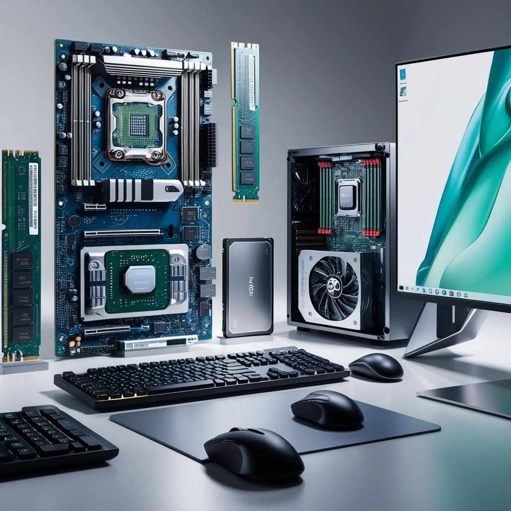

<!--

author:   Mr. Hartmann

email:    hartmann@uber.space

version:  0.0.1

language: de

-->

# Informatikkurs für die 6. Klasse

Willkommen zum Onlinekurs für Informatik in der 6. Klasse! In diesem Kurs lernst du die Grundlagen der Informatik kennen: von den Grundlagen zu Informationen und Daten bis hin zu spannenden Themen wie Programmierung und künstliche Intelligenz.

---

## 1. Informatiksysteme? Informationen und Daten
 
> **Definition:** Ein Informatiksystem ist ein System, das zur Speicherung, Verarbeitung und Übertragung von Informationen und Daten genutzt wird.

Ein **Computer** ist viel mehr als nur ein Gerät zum Spielen oder Schreiben von Texten. In der Informatik betrachten wir den Computer als ein **Informatiksystem**, das Daten verarbeiten, speichern und weitergeben kann. Lass uns anschauen, wie so ein System funktioniert und aus welchen Teilen es besteht.

### Was ist ein Informatiksystem?

Ein **Informatiksystem** ist eine Kombination aus **Hardware** (den physischen Teilen) und **Software** (den Programmen). Zusammen ermöglichen sie dem Computer, verschiedene Aufgaben zu erledigen, wie Berechnungen durchzuführen, Musik abzuspielen oder Spiele zu starten.

Stell dir ein Informatiksystem wie eine Art „Team“ vor, bei dem verschiedene „Spieler“ (Computer, Programme und Menschen) zusammenarbeiten. Jeder Spieler hat seine eigene Rolle und Aufgabe, und nur wenn alle gut zusammenarbeiten, funktioniert das System richtig.

**Beispiel 1: Die Schule als Informatiksystem**

In einer Schule gibt es viele Informationen, wie Stundenpläne, Noten oder Anwesenheitslisten. Früher war alles auf Papier, aber heute wird vieles mit Computern gemacht. Ein Schul-Informatiksystem hilft dabei, alle Informationen zu verwalten:

- Computer: Die Computer in der Schule speichern die Informationen.
- Programme: Ein spezielles Programm oder eine App hilft den Lehrern, Noten einzugeben oder Stundenpläne zu erstellen.
- Menschen: Lehrer, Schüler und Schulsekretärinnen nutzen das System. Sie geben Informationen ein oder lesen sie ab.

Hier arbeiten alle zusammen: Lehrer und Sekretärinnen tippen die Informationen in das System, die Computer speichern es, und die Programme machen es übersichtlich. Schüler können ihre Noten sehen, Lehrer wissen, wann sie Unterricht haben – das ist praktisch und spart Zeit.

**Beispiel 2: Das Wettervorhersage-System**

Ein anderes Beispiel ist ein Informatiksystem zur Wettervorhersage. Die Wettervorhersage benutzt ein großes Informatiksystem, um uns zu sagen, wie das Wetter morgen oder nächste Woche wird. Dieses System funktioniert so:

- Computer: Die Computer sammeln Daten über das Wetter von überall auf der Welt.
- Programme: Diese Daten werden mit speziellen Programmen analysiert, die das Wetter genau berechnen und vorhersagen können.
- Menschen: Wetterforscher und Meteorologen überwachen das System und interpretieren die Ergebnisse.

Dank dieses Informatiksystems können wir jeden Tag wissen, ob es regnen oder die Sonne scheinen wird.

**Beispiel 3: Das Smartphone**

Dein Handy ist auch ein kleines Informatiksystem. Es besteht aus:

- Computerteilen: Das ist die Technik, also der „Computer“ im Handy.
- Apps: Jede App ist ein kleines Programm, das bestimmte Aufgaben übernimmt, z. B. Nachrichten senden, Fotos machen oder Musik abspielen.
- Du: Als Nutzer gibst du Daten ein (z. B. schreibst eine Nachricht oder machst ein Foto) und bekommst Informationen zurück (z. B. Antworten oder Fotos).

Dein Handy speichert deine Kontakte, erinnert dich an Termine und zeigt dir Wetter und Nachrichten – all das ist möglich, weil es als Informatiksystem funktioniert.

### Die Bauteile eines Computers

Ein Computer hat mehrere wichtige Bauteile, die alle zusammenarbeiten. 

1. **Prozessor (CPU)**  
   Der Prozessor, auch CPU genannt, ist das "Gehirn" des Computers. Er führt alle Berechnungen und Aufgaben aus, die ein Programm ihm vorgibt. Je schneller der Prozessor, desto schneller kann der Computer arbeiten.

3. **Arbeitsspeicher (RAM)**  
   Der Arbeitsspeicher ist der Platz, an dem der Computer Daten vorübergehend speichert, die er gerade verwendet. Je mehr RAM, desto mehr Daten kann der Computer gleichzeitig verarbeiten.

4. **Festplatte oder SSD**  
   Die Festplatte oder SSD ist der Langzeitspeicher des Computers. Hier werden Dateien, Programme und das Betriebssystem gespeichert. Ohne Speicher könnte der Computer keine Daten behalten, wenn er ausgeschaltet wird.

5. **Grafikkarte**  
   Die Grafikkarte ist für die Anzeige von Bildern und Videos verantwortlich. Sie berechnet, was auf dem Bildschirm zu sehen ist. Besonders bei Spielen oder Videos ist eine gute Grafikkarte wichtig.

6. **Eingabegeräte**  
   Dazu gehören Geräte wie die **Tastatur** und die **Maus**. Mit ihnen gibst du dem Computer Anweisungen, zum Beispiel beim Tippen oder Klicken.

7. **Ausgabegeräte**  
   Bildschirm und Drucker sind typische Ausgabegeräte. Sie zeigen dir die Ergebnisse der Arbeit des Computers.
---

### 🖥️ Beispiele für Hardware:

**Was gehört zur Hardware?**

1. Prozessor (CPU) 💡
   * Das "Gehirn" des Computers. Es verarbeitet alle Befehle.

2. Bildschirm (Monitor) 📺
   * Zeigt alles an, was ihr auf dem Computer sehen wollt.

3. Tastatur ⌨️
   * Damit könnt ihr Texte schreiben und Befehle eingeben.

4. Maus 🖱️
   * Zum Zeigen und Klicken auf Dinge auf dem Bildschirm.

5. Drucker 🖨️
   * Druckt eure Dokumente auf Papier aus.

6. Lautsprecher 🔊
   * Gibt Geräusche und Musik wieder.

---

### 🖥️ Was ist Software?
Software besteht aus Programmen und Daten, die auf der Hardware laufen. Ihr könnt Software nicht anfassen, aber sie ist dafür verantwortlich, dass euer Computer funktioniert und ihr ihn benutzen könnt.

**Welche der folgenden Dinge gehören zur Hardware? Markiere die richtigen Antworten:**

- [( )] Word (ein Textverarbeitungsprogramm)
- [(x)] Festplatte (Speichert Daten)
- [(x)] Grafikkarte (Verarbeitet Bilder)
- [( )] Minecraft (ein Computerspiel)

**Was gehört zur Software?**

1. Betriebssystem (OS) 🛠️
   * Das wichtigste Programm auf eurem Computer. Beispiele sind **Windows**, **macOS** oder **Linux**.
  
2. Textverarbeitungsprogramme ✍️
   * Damit könnt ihr Texte schreiben, z.B. **Microsoft Word** oder **Libre Office**.
  
3. Spiele 🎮
   * Macht Spaß und hilft beim Lernen. Ein Beispiel ist **Minecraft**.
  
4. Webbrowser 🌐
   * Damit könnt ihr im Internet surfen, z.B. **Google Chrome** oder **Firefox**.

5. Musik-Player 🎵
   * Spielt Musik ab, z.B. **Spotify** oder **Apple Music**.

**Welche der folgenden Dinge gehören zur Software? Markiere die richtigen Antworten:**

- [(x)] Webbrowser (zum Surfen im Internet)
- [( )] Bildschirm (zeigt Bilder an)
- [(x)] Computerspiel (wie Fortnite)
- [( )] Tastatur (zum Eingeben von Text)
  
### Wie funktionieren Informatiksysteme?

Ein Informatiksystem arbeitet nach dem Prinzip **Eingabe – Verarbeitung – Ausgabe**:

1. **Eingabe**: Du gibst Informationen in den Computer ein, zum Beispiel durch Tippen auf der Tastatur oder Bewegen der Maus.
2. **Verarbeitung**: Der Computer verarbeitet diese Informationen mithilfe von Hardware und Software. Der Prozessor berechnet zum Beispiel Zahlen oder bearbeitet Texte.
3. **Ausgabe**: Das Ergebnis der Berechnung wird angezeigt, entweder auf dem Bildschirm oder durch ein anderes Ausgabegerät.

Beispiel: Ein Spiel spielen:

- **Eingabe**: Du drückst Tasten und bewegst die Maus, um eine Figur zu steuern.
- **Verarbeitung**: Der Prozessor und die Grafikkarte berechnen, wie die Figur sich bewegt und was im Spiel passieren soll.
- **Ausgabe**: Die Grafikkarte zeigt das Ergebnis der Berechnung auf dem Bildschirm, damit du die Bewegung deiner Figur siehst.

### Warum sind Informatiksysteme wichtig?

Informatiksysteme sind heute überall: in Smartphones, Laptops, Tablets und sogar in Autos oder Kühlschränken. Sie helfen uns im Alltag, Daten zu speichern, zu kommunizieren und Aufgaben zu automatisieren. Ohne Informatiksysteme wäre die Welt, wie wir sie heute kennen, nicht möglich.

### 📝 **Aufgabe**  
Finde heraus, welche Hardwarekomponenten in dem Computer im Klassenraum verbaut sind (sollte kein Computer im Klassenraum stehen, schaue dir das Bild an). Liste sie auf und erkläre, welche Funktion sie jeweils haben. Beispiele sind die CPU (Prozessor), der Arbeitsspeicher (RAM) und die Festplatte (Speicher). Löse danach das multiple-choice Quiz.

### **Quiz**

Der Begriff Hardware beschreibt .... 
- [[ ]] alles, was man nicht am Computer anfassen kann, wie der Prozessor, der Bildschirm oder die Tastatur, gehört zur Hardware ...
- [[X]] alles, was man am Computer anfassen kann, wie der Prozessor, der Bildschirm oder die Tastatur ...
- [[ ]] Programme und Daten, die auf der Hardware laufen, nennt man Software. Dazu zählen das Betriebssystem (wie Windows oder macOS) und alle Programme (wie Spiele, Textverarbeitungsprogramme oder der Webbrowser) ...

---

## 1.1 Verwaltung von Dateien

> **Info:** Dateien sind digitale Sammlungen von Informationen, die wir auf Computern speichern. Alles, was du am Computer erstellst oder speicherst – seien es Texte, Bilder oder Musik – wird als Datei abgelegt.

Die Verwaltung von Dateien ist ein wichtiger Teil der Arbeit am Computer. Dateien enthalten alle Informationen, die du speicherst: Texte, Bilder, Videos, Musik und vieles mehr. Um die Übersicht zu behalten, ist es wichtig, Dateien gut zu organisieren und zu verwalten.

## Was sind Dateien?

Eine **Datei** ist ein digitaler Behälter für Daten. Jedes Dokument, Foto oder Video, das du auf deinem Computer speicherst, ist eine Datei. Dateien haben immer einen **Namen** und eine **Erweiterung** (z. B. `.txt`, `.jpg` oder `.mp3`), die dir und dem Computer sagt, um welchen Dateityp es sich handelt.

**Wichtige Dateitypen**

- **Textdateien** (.txt, .docx) – Für geschriebene Texte, wie Berichte, Aufsätze oder Notizen.
- **Bilddateien** (.jpg, .png) – Für Fotos und Grafiken.
- **Audiodateien** (.mp3, .wav) – Für Musik oder Sprachaufnahmen.
- **Videodateien** (.mp4, .avi) – Für Filme und Videos.

### Ordner und Dateien organisieren

Damit du deine Dateien leicht findest, solltest du sie in **Ordnern** organisieren. Ein Ordner ist wie ein digitales Ablagefach, in dem du ähnliche Dateien zusammen speichern kannst.

**Beispiel für eine Ordnerstruktur**

Stell dir vor, du erstellst Ordner für die Schule:

- **Schule**
  - **Mathematik**
    - Aufgaben_2024.docx
    - Formeln.png
  - **Deutsch**
    - Aufsatz.docx
    - Buchnotizen.txt
  - **Biologie**
    - Projekt_Pflanzen.pptx

Mit dieser Struktur findest du schnell deine Dateien, weil du weißt, in welchem Ordner sie gespeichert sind.

### Dateien umbenennen, kopieren und verschieben

Um Dateien gut zu verwalten, kannst du sie **umbenennen**, **kopieren** und **verschieben**.

- **Umbenennen**: Wenn du den Namen einer Datei änderst, hilft dir das, die Datei leichter zu finden. Zum Beispiel könntest du "Aufsatz.docx" in "Deutsch_Aufsatz_ThemaXY.docx" umbenennen.
- **Kopieren**: Wenn du eine Datei an einem anderen Ort brauchst, aber das Original behalten möchtest, kannst du sie kopieren.
- **Verschieben**: Verschieben bedeutet, die Datei in einen anderen Ordner zu legen, ohne eine Kopie zu erstellen.

### Dateien löschen

Wenn du eine Datei nicht mehr brauchst, kannst du sie **löschen**. Gelöschte Dateien werden oft zuerst in den Papierkorb verschoben. Dort bleiben sie, bis du den Papierkorb leerst – dann sind sie wirklich gelöscht.

**Achtung beim Löschen!**

Gelöschte Dateien können nicht immer wiederhergestellt werden. Überlege also gut, bevor du eine Datei löschst, oder sichere sie vorher.

### Wichtige Tipps für die Dateiverwaltung

1. **Sinnvolle Namen verwenden**: Gebe deinen Dateien Namen, die den Inhalt beschreiben.
2. **Ordnerstruktur nutzen**: Lege eine klare Ordnerstruktur an, die du verstehst und leicht durchsuchen kannst.
3. **Regelmäßig aufräumen**: Lösche alte oder unnötige Dateien, um Platz zu sparen.
4. **Dateien sichern (Backup)**: Speichere wichtige Dateien auf einem USB-Stick, einer externen Festplatte oder in der Cloud, um sie bei Verlust wiederherstellen zu können.

### Warum ist die Verwaltung von Dateien wichtig?

Eine gute Dateiverwaltung hilft dir, schnell die Dateien zu finden, die du brauchst. Sie spart Zeit und macht deinen Computer übersichtlicher. Das ist besonders praktisch für die Schule oder die Arbeit, wo du oft mit vielen verschiedenen Dateien zu tun hast.

### 📝 **Aufgabe**  
Erstelle eine sinnvolle Ordnerstruktur auf deinem Computer. Zum Beispiel: "Schule" > "Informatik" > "Projekte". Lege eine neue Datei an und speichere sie in diesem Ordner. Schreibe auf, wie deine Ordner heißen und warum du diese Struktur gewählt hast.

## 1.3 Dateiformate

Dateien haben verschiedene **Formate**, die festlegen, wie die Daten in der Datei gespeichert werden. Das Dateiformat wird oft durch die Dateiendung (z. B. `.txt`, `.odt`, `.docx`, `.png`, `.jpg`, `.webp`, `.mp3`, `.mp4`) angezeigt und bestimmt, welche Programme die Datei öffnen können.

Hier sind einige gängige Dateiformate:

- **.txt** - Textdateien, die einfachen Text ohne Formatierung enthalten
- **.jpg/.png** - Bilddateien für Fotos und Grafiken
- **.mp3** - Audiodateien, die zum Speichern von Musik oder Ton verwendet werden

Ein Bild wird anders gespeichert und verarbeitet als ein Text oder eine Musikdatei. Deshalb können wir Dateien nicht beliebig in anderen Programmen öffnen – ein Musikprogramm wird z. B. eine Bilddatei nicht abspielen können.

### 📝 **Aufgabe**  
Finde drei verschiedene Dateiformate auf deinem Computer und notiere sie. Erkläre, wofür diese Formate verwendet werden und welche Programme sie öffnen können.

---

## 1.4 Das Internet

!?[Wie funktioniert das Internet?]([https://www.youtube.com/watch?v=8pTEmbeENF4](https://youtu.be/fpqhjEtznVk)

Das **Internet** ist ein riesiges Netzwerk, das Millionen von Computern weltweit miteinander verbindet. Es wurde ursprünglich entwickelt, um Informationen auszutauschen, und ist heute eine wichtige Infrastruktur für den Zugang zu Informationen, für Kommunikation und für Unterhaltung.

Das Internet besteht aus verschiedenen **Diensten**, wie z. B.:

- **WWW (World Wide Web)**: Webseiten und deren Inhalte, die über Webbrowser aufgerufen werden.
- **E-Mail**: Elektronische Post, mit der man Nachrichten versenden und empfangen kann.
- **Soziale Netzwerke**: Plattformen wie Instagram, TikTok oder Facebook, auf denen man mit anderen in Kontakt bleiben kann.

> **Erklärung:** Das Internet basiert auf einer Technologie namens TCP/IP (Transmission Control Protocol / Internet Protocol), die dafür sorgt, dass Datenpakete sicher und schnell von einem Computer zum anderen übertragen werden.

### 📝 **Aufgabe**  
Recherchiere, wie das Internet funktioniert. Schreibe eine kurze Zusammenfassung in deinen eigenen Worten. Tipp: Versuche zu erklären, was ein Router ist und welche Rolle er im Internet spielt.

---

## 1.5 Das EVA-Prinzip

Das **EVA-Prinzip** beschreibt die grundlegende Arbeitsweise eines Computers und steht für **Eingabe - Verarbeitung - Ausgabe**.

1. **Eingabe (Input)**: Der Computer erhält Informationen von außen, z. B. durch die Tastatur oder eine Maus.
2. **Verarbeitung (Processing)**: Diese Informationen werden von der CPU (dem Prozessor) bearbeitet und verarbeitet.
3. **Ausgabe (Output)**: Das Ergebnis wird ausgegeben, z. B. auf dem Bildschirm oder durch einen Drucker.

> **Beispiel:** Wenn du einen Taschenrechner auf dem Computer nutzt, gibst du eine Rechenaufgabe (Eingabe) ein, der Computer berechnet die Aufgabe (Verarbeitung) und zeigt dir das Ergebnis (Ausgabe).

#### 📝 **Aufgabe 1.5:**  
Beschreibe einen Alltagsgegenstand, der das EVA-Prinzip verwendet (z. B. eine Kaffeemaschine oder ein Fahrkartenautomat) und erkläre, wie das Prinzip angewendet wird.

---

## 1.6 Binärzahlen einfach erklärt

Binärzahlen sind ein Zahlensystem, das nur **zwei** Ziffern verwendet: **0** und **1**. Während wir im Alltag das **Dezimalsystem** (mit den Ziffern 0 bis 9) nutzen, arbeiten Computer und elektronische Geräte mit Binärzahlen, weil sie einfacher für Maschinen zu verarbeiten sind.

**Warum nur 0 und 1?**

Computer können in ihrer Elektronik nur zwei Zustände unterscheiden:
- **Ein** (Strom fließt) – das entspricht der **1**
- **Aus** (kein Strom fließt) – das entspricht der **0**

Durch diese Zustände können Computer Daten speichern und Berechnungen durchführen.

**Wie funktionieren Binärzahlen?**

Im Dezimalsystem ist jede Stelle einer Zahl ein Vielfaches von **10**:
- Die Zahl **123** bedeutet: \(1 \times 100 + 2 \times 10 + 3 \times 1\)

Im Binärsystem ist jede Stelle ein Vielfaches von **2**:
- Die Zahl **101** im Binärsystem bedeutet:
  \(1 \times 4 + 0 \times 2 + 1 \times 1 = 5\)

| Dezimalzahl | Binärzahl |
| ----------- | --------- |
| 0           | 0         |
| 1           | 1         |
| 2           | 10        |
| 3           | 11        |
| 4           | 100       |
| 5           | 101       |

**So wandelst du Dezimalzahlen in Binärzahlen um** 

1. **Teilen durch 2**: Teile die Zahl immer durch 2 und schreibe den Rest auf.
2. **Von unten nach oben lesen**: Wenn du nicht weiter teilen kannst, nimm die Reste und lies sie von unten nach oben.

**Beispiel: Die Zahl 13 ins Binärsystem umwandeln**

1. 13 : 2 = 6 Rest **1**
2. 6 : 2 = 3 Rest **0**
3. 3 : 2 = 1 Rest **1**
4. 1 : 2 = 0 Rest **1**

Ergebnis (von unten nach oben gelesen): **1101**

**Warum sind Binärzahlen wichtig?**

Binärzahlen sind die Grundlage aller modernen Computertechnologien! Alles, was ein Computer macht – egal ob ein Bild anzeigen, ein Lied abspielen oder ein Spiel laufen lassen – basiert auf Binärzahlen.

### Aufgaben

Löse die Aufgaben auf Inf-Schule:
- [Inf-Schule](https://inf-schule.de/information/darstellunginformation)

---

## 2. Daten und Codierung

In der Informatik nutzen wir **Codes**, um Informationen und Daten in einer Form darzustellen, die der Computer verarbeiten kann. Der einfachste Code ist das **binäre Zahlensystem**, das nur die Zahlen 0 und 1 verwendet. Im binären System werden alle Daten als Kombinationen dieser beiden Zahlen dargestellt – z. B. Buchstaben, Zahlen, Bilder und sogar Töne.

> **Wusstest du?** Der Computer kann mit den Werten 0 und 1 arbeiten, weil er aus vielen winzigen elektrischen Schaltern besteht, die nur "an" (1) oder "aus" (0) sein können.
---

### 2.1 Winkeralphabet, Morsecode, Caesar-Verschlüsselung

**Winkeralphabet, Morsecode und Caesar-Verschlüsselung** sind einfache Arten, Informationen in eine andere Form zu bringen.

- **Winkeralphabet**: Eine Methode zur Kommunikation über große Entfernungen. Mit zwei Fahnen können Zeichen übermittelt werden.
- **Morsecode**: Ein Code aus kurzen und langen Signalen (Punkten und Strichen), der genutzt wurde, um Nachrichten über Funk zu senden.
- **Caesar-Verschlüsselung**: Ein Verschlüsselungsverfahren, das jeden Buchstaben um eine feste Anzahl Stellen im Alphabet verschiebt.

--- 

### 2.2 Einführung ins Winkeralphabet

Das **Winkeralphabet** ist eine Methode der visuellen Kommunikation, die zur Übertragung von Nachrichten über größere Distanzen genutzt wird. Ursprünglich fand es Anwendung in der Schifffahrt und im Militär. Beim Winkeralphabet hält eine Person zwei Fahnen und zeigt diese in bestimmten Positionen, um verschiedene Buchstaben zu signalisieren. Jede Position der Fahnen repräsentiert dabei einen bestimmten Buchstaben des Alphabets.

#### Funktionsweise des Winkeralphabets

- Es gibt **acht Grundpositionen** für jede Hand.
- Jede Position stellt eine Kombination dar, die einem Buchstaben entspricht.
- Die Winkpositionen sind in einem 45-Grad-Winkel verteilt.
- Um eine Nachricht zu senden, bewegt die Person die Fahnen schnell in die Positionen, die die Buchstaben der Nachricht repräsentieren.

#### Beispielhafte Winkepositionen für einige Buchstaben:

- **Position für den Buchstaben A**: Linke Hand oben links, rechte Hand oben rechts
- **Position für den Buchstaben B**: Linke Hand direkt links, rechte Hand direkt rechts
- **Position für den Buchstaben S**: Linke Hand unten links, rechte Hand oben rechts

---

### Quiz

Wie würdest du den Buchstaben "S" mit dem Winkeralphabet darstellen?

1. [[ ]] Linke Hand unten, rechte Hand oben
2. [[ ]] Linke Hand links, rechte Hand rechts
3. [[x]] Linke Hand unten links, rechte Hand oben rechts
4. [[ ]]Linke Hand oben links, rechte Hand unten rechts

---

## 3. Programmieren I

### 3.1 Algorithmen im Alltag

**Algorithmen im Alltag: Was steckt dahinter?**

---

**Was ist ein Algorithmus überhaupt?**

Stell dir vor, du möchtest ein leckeres Rezept nachkochen, zum Beispiel Pfannkuchen. Du brauchst dafür Zutaten wie Mehl, Milch und Eier, und du musst genau wissen, wie du sie miteinander mischen sollst, damit die Pfannkuchen am Ende richtig schmecken. Die Anleitung, die dir Schritt für Schritt erklärt, was du tun musst, damit das Rezept gelingt, nennt man **Algorithmus**.

Ein **Algorithmus** ist also eine Abfolge von klaren Anweisungen oder Schritten, die du befolgen musst, um ein bestimmtes Ziel zu erreichen. Er hilft uns, Probleme zu lösen, Aufgaben zu erledigen und Dinge effizienter zu machen.

---

**Beispiele für Algorithmen im Alltag**

Du wirst überrascht sein, wie oft du im Alltag Algorithmen nutzt, ohne es zu merken! Hier sind einige Beispiele:

1. **Morgens Zähneputzen**
Wenn du morgens aufstehst, folgst du ganz automatisch einer Reihe von Schritten, um deine Zähne zu putzen:
   - **Schritt 1**: Zahnbürste nehmen.
   - **Schritt 2**: Zahnpasta auf die Bürste auftragen.
   - **Schritt 3**: Zähne für 2 Minuten putzen.
   - **Schritt 4**: Mund ausspülen und Zahnbürste weglegen.

Dieser Ablauf ist ein simpler Algorithmus, der dir hilft, deine Zähne sauber zu halten.

2. **Weg zur Schule finden**
Angenommen, du gehst jeden Morgen zu Fuß zur Schule. Du weißt genau, welche Straßen du nehmen musst und an welcher Ampel du abbiegen musst. Dein Weg zur Schule ist ein Algorithmus:
   - **Schritt 1**: Haus verlassen und nach links abbiegen.
   - **Schritt 2**: Zwei Straßen geradeaus gehen.
   - **Schritt 3**: An der Kreuzung rechts abbiegen.
   - **Schritt 4**: Die Straße überqueren, wenn die Ampel grün ist.
   - **Schritt 5**: Die Schule betreten.

Wenn du dich immer an diese Schritte hältst, kommst du sicher zur Schule.

3. **Apps auf deinem Smartphone**
Auch dein Handy nutzt ständig Algorithmen. Wenn du z. B. YouTube benutzt, um ein Video anzusehen, entscheidet ein Algorithmus, welche Videos dir vorgeschlagen werden. Er schaut sich an, welche Videos du dir gerne ansiehst, und sucht ähnliche Videos heraus, die dir auch gefallen könnten. Das Ziel ist, dir nur solche Videos anzuzeigen, die für dich interessant sind.

---

**Wie funktionieren Algorithmen?**

Ein Algorithmus arbeitet ähnlich wie eine Art **Kochrezept** oder **Bauanleitung**. Die Anweisungen müssen **genau** und **logisch** sein, damit der Computer oder eine Maschine sie verstehen kann. Diese Anweisungen bestehen oft aus folgenden Bausteinen:

1. **Eingaben**: Das sind die Informationen oder Daten, die der Algorithmus braucht, um zu funktionieren.
   - Beispiel: Deine Lieblingsmusik auf Spotify.

2. **Verarbeitung**: Hier verarbeitet der Algorithmus die Eingaben, um ein Ergebnis zu berechnen oder zu finden.
   - Beispiel: Der Algorithmus sucht ähnliche Lieder heraus, die dir gefallen könnten.

3. **Ausgaben**: Am Ende gibt der Algorithmus ein Ergebnis oder eine Lösung aus.
   - Beispiel: Eine Liste von Liedern, die du wahrscheinlich mögen wirst.

---

**Warum sind Algorithmen so wichtig?**

Algorithmen helfen uns, Probleme schnell und effizient zu lösen. Besonders Computer und Maschinen brauchen sie, um zu funktionieren. Ohne Algorithmen könnten viele Dinge in unserem Alltag nicht so einfach und bequem ablaufen:

- **Google** nutzt Algorithmen, um dir die besten Suchergebnisse anzuzeigen.
- **Online-Shops** wie Amazon verwenden Algorithmen, um dir Produkte vorzuschlagen, die dir gefallen könnten.
- **Navigations-Apps** wie Google Maps berechnen mithilfe von Algorithmen den schnellsten Weg zu deinem Ziel.

---

**Ein kleines Experiment: Ein eigener Algorithmus**

Jetzt kannst du selbst ausprobieren, wie ein einfacher Algorithmus funktioniert. Stell dir vor, du möchtest eine bestimmte Seite in deinem Mathebuch finden. Hier ist ein Algorithmus, der dir hilft:

1. **Öffne dein Buch in der Mitte**.
2. **Wenn die Seite zu groß ist**, blättere eine bestimmte Anzahl Seiten nach links.
3. **Wenn die Seite zu klein ist**, blättere nach rechts.
4. Wiederhole diesen Vorgang, bis du die richtige Seite gefunden hast.

Du hast gerade einen **Suchalgorithmus** verwendet, der dir hilft, die Seite schneller zu finden, als wenn du Seite für Seite durchblättern würdest!

Algorithmen sind also überall in unserem Alltag zu finden, auch wenn wir sie nicht immer bewusst wahrnehmen. Sie helfen uns, Aufgaben schneller und effizienter zu erledigen – egal, ob beim Zähneputzen, auf dem Weg zur Schule oder beim Surfen im Internet. Wenn du das nächste Mal ein Rezept kochst oder eine Route planst, denk daran: Du folgst gerade einem Algorithmus!

**Frage an dich**: Wo könntest du heute noch Algorithmen in deinem Leben entdecken?

---

## 3.2 Erste Schritte in Scratch

Scratch ist eine visuelle Programmiersprache, die das Programmieren auf spielerische Weise näherbringt. In Scratch fügst du verschiedene **Blöcke** zusammen, um Figuren zu steuern, Animationen zu erstellen und einfache Programme zu entwickeln.

### 📝 **Aufgabe**  
Öffne Scratch und erstelle ein kleines Programm, in dem eine Figur sich über den Bildschirm bewegt und dabei ein Geräusch abspielt. Experimentiere mit den Blöcken für Bewegung und Klang.

---

### 3.3 Ein Scratch-Projekt für Anfänger

Erstelle ein Fangspiel in Scratch, in dem der Spieler eine Figur steuert, um Punkte zu sammeln, wenn sie ein bestimmtes Objekt berührt.

### 📝 **Aufgabe**  
Erstelle ein einfaches Fangspiel in Scratch. Die Figur soll sich steuern lassen, und jedes Mal, wenn sie ein Objekt berührt, soll ein Punkt gezählt werden.

---

## 4. Programmieren II

### 4.1 Entscheidungen

Entscheidungen werden in der Programmierung durch **wenn-dann-Bedingungen** getroffen. So kann das Programm auf verschiedene Eingaben oder Situationen unterschiedlich reagieren.

### 📝 **Aufgabe**  
Erstelle ein Scratch-Programm, in dem eine Figur eine Entscheidung trifft. Zum Beispiel: "Wenn die Figur an den Rand stößt, dann soll sie umkehren."

---

### 4.2 Bedingte Wiederholungen

**Schleifen** ermöglichen, dass Anweisungen wiederholt ausgeführt werden, solange eine bestimmte Bedingung erfüllt ist.

### 📝 **Aufgabe**  
Erstelle eine Schleife in Scratch, in der eine Figur so lange bewegt wird, bis sie ein bestimmtes Ziel erreicht.

---

## 5. Automatisierung und Künstliche Intelligenz

### 5.1 Was sind Automaten?

Ein **Automat** ist ein System, das bestimmte Aufgaben selbstständig erledigt, oft nach einem festen Programm oder Plan. Beispiele sind Ampelanlagen oder Waschmaschinen.

### 📝 **Aufgabe 5.1:**  
Nenne drei Automaten, die du im Alltag kennst, und erkläre kurz, wie sie funktionieren und welche Aufgaben sie automatisch ausführen.

---

### 5.2 Künstliche Intelligenz

**Künstliche Intelligenz (KI)** ermöglicht es Maschinen, Aufgaben zu übernehmen, die normalerweise menschliches Denken erfordern, wie z. B. Sprache erkennen, Bilder deuten oder Entscheidungen treffen.

### 📝 **Aufgabe 5.2:**  
Recherchiere, wo KI im Alltag vorkommt. Finde drei Beispiele und schreibe, wie KI in diesen Anwendungen genutzt wird.
